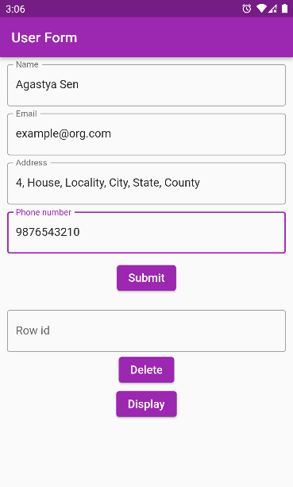

# Simple Flutter App

Flutter app to create, display, delete a record in SQL database.

## Screenshots
### Starting the App
&nbsp;&nbsp;&nbsp;&nbsp;&nbsp;

------------

### Filling the form

------------

### Display Screen
&nbsp;&nbsp;&nbsp;&nbsp;&nbsp;

------------

### Delete Record
&nbsp;&nbsp;&nbsp;&nbsp;&nbsp;&nbsp;&nbsp;&nbsp;&nbsp;&nbsp;